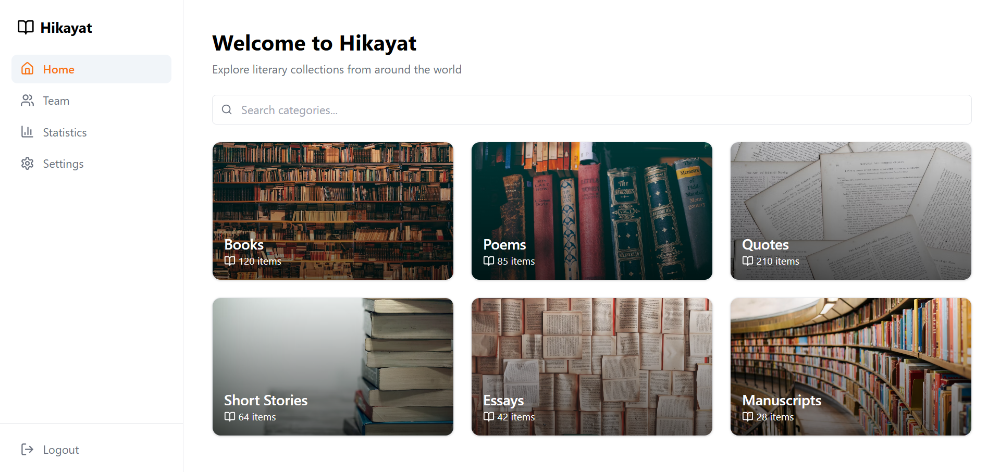

# Hikayat Web App Design Test (A)

This is a submission for the Hikayat Web App Design Test based on the provided Figma design.

### Home Page  


---

## 📦 Tech Stack
- React.js
- Tailwind CSS
- React Router
- useState / useEffect (for state management)
- Mock data for team and categories

---

## 🚀 How to Run the App

1. Clone the repository:
   ```bash
   git clone https://github.com/MUSA-apnacollege/hikayat-web-app.git
   cd hikayat-web-app
   npm install
   npm start


   ✅ Features Completed
Home Page with dynamic categories using mock data

Team Management Page:

View/Add/Edit/Delete members

Basic form validation

Statistics Dashboard:

Dynamic summary of collection counts

Navigation with React Router

Reusable components (Sidebar, Card, Form)

Responsive layout (partially or fully)


🧠 Thought Process & Challenges
Focused on modularity — broke the UI into reusable components.

Used useState and useEffect for managing local state.

Mock data was created to simulate real content without API.

Styling was based closely on the Figma design using modern CSS/SCSS (or Tailwind, if used).

Challenge: Managing component layout to match exact Figma design — learned a lot!


🧩 Challenges Faced
Tailwind custom class styling and hover effects needed careful overrides.

Ensuring responsive design and smooth UX took fine-tuning.

Managing edit vs. add functionality in forms.

🛠️ Potential Improvements
Add persistent storage (e.g., saving data in localStorage or integrating with a real backend in the future).

Show loading indicators or success/error messages for better user feedback.

Use a form library like react-hook-form for cleaner form validation and state handling.


